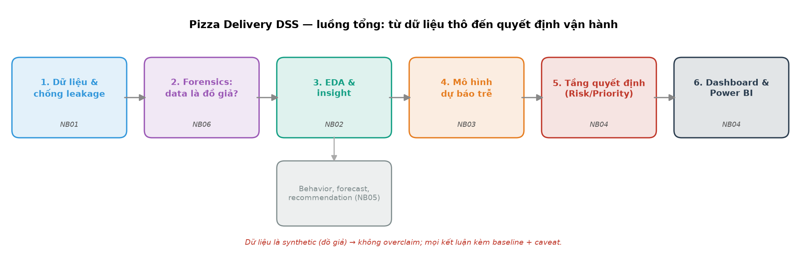

# 👋 ĐỌC FILE NÀY ĐẦU TIÊN (cho người mới / trái ngành)

Bạn chưa biết gì về ML hay "hệ hỗ trợ quyết định" cũng đọc hết được. File này là
**cửa vào**: kể câu chuyện dự án bằng lời thường, chỉ thứ tự đọc, và cách hiểu các
con số. Thuật ngữ khó tra ở [`docs/GLOSSARY.md`](docs/GLOSSARY.md).

---

## 1. Dự án này làm gì? (giải thích như cho người ngoài ngành)

Tưởng tượng bạn quản lý một chuỗi tiệm pizza giao tận nhà. Mỗi ngày có rất nhiều
đơn, và **một số đơn sẽ bị giao trễ** — khách bực, mất uy tín. Vấn đề: lúc đơn vừa
đặt, bạn **chưa biết** đơn nào sẽ trễ để lo trước.

Dự án xây một **trợ lý ra quyết định**:
1. **Đoán trước** đơn nào có nguy cơ trễ (dựa trên quãng đường, kẹt xe, size pizza…).
2. **Chấm điểm rủi ro** 0–100 và xếp **mức ưu tiên** Thấp / Vừa / Cao.
3. **Gợi ý hành động**: theo dõi, chuẩn bị tài xế dự phòng, báo khách…
4. Trình bày tất cả trên **dashboard** cho quản lý.

> 🧠 **Một sự thật quan trọng (đừng bỏ qua):** bộ dữ liệu tải từ Kaggle hoá ra là
> **dữ liệu "đồ giả"** (do máy sinh tự động, không phải đơn hàng thật). Nhóm
> **không giả vờ** nó là thật. Thay vào đó, nhóm **chứng minh** nó là đồ giả
> (chương "forensics") rồi **vẫn chạy đúng toàn bộ quy trình** để học cách làm.
> Vì vậy điểm số mô hình rất cao **không** có nghĩa "đoán giỏi ngoài đời" — nó
> chỉ nói "quy trình đúng". Đây là điểm trung thực, không phải điểm yếu.

---

## 2. Đi qua dự án theo thứ tự này (mỗi notebook học được gì)

Mở thư mục `notebooks/` và đọc theo số. Mỗi notebook đã **chạy sẵn**, có biểu đồ
và **một dòng giải thích ngay dưới mỗi bảng/hình**, nên chỉ cần đọc — không cần chạy.



| Thứ tự | Notebook | Học được gì (1 câu) |
|---|---|---|
| 1 | `01_data_audit_preprocessing` | Dữ liệu có gì, "rò rỉ" là gì và vì sao phải cấm vài cột. |
| 2 | `06_data_forensics` | Bằng chứng dữ liệu là đồ giả (công thức ẩn, ngưỡng nhãn). |
| 3 | `02_eda` | Yếu tố nào làm đơn trễ (kẹt xe, quãng đường), đọc biểu đồ. |
| 4 | `05_business_...` | Hành vi khách, dự báo nhu cầu, gợi ý — và vì sao chỉ là minh hoạ. |
| 5 | `03_modeling` | So sánh 6 mô hình, chọn cái tốt nhất, đo bằng chỉ số gì. |
| 6 | `04_dss_optimization_powerbi` | Biến dự đoán thành quyết định + gán tài xế + dashboard. |

Sau đó muốn xem bản hoàn chỉnh: đọc `reports/PIZZA_DSS_REPORT.pdf` (có mục **"Tám
câu hỏi bắt buộc"** trả lời gọn ở đầu) hoặc chạy dashboard:
`streamlit run app/streamlit_app.py`.

Tài liệu phụ: [`docs/GLOSSARY.md`](docs/GLOSSARY.md) (từ điển),
[`docs/WORKFLOW_PRESENTATION_GUIDE.md`](docs/WORKFLOW_PRESENTATION_GUIDE.md) (hướng
dẫn trình bày), [`reports/REPORT_GUIDE.md`](reports/REPORT_GUIDE.md) (nội dung
báo cáo), [`slides/SLIDE_GUIDE.md`](slides/SLIDE_GUIDE.md) (nói slide),
[`powerbi/POWERBI_BUILD_GUIDE.md`](powerbi/POWERBI_BUILD_GUIDE.md) (dựng Power
BI), [`docs/_internal/SCOPE_PRIORITIZATION.md`](docs/_internal/SCOPE_PRIORITIZATION.md) (cái gì nên
đưa vào report/slide chính), [`GOAL.md`](GOAL.md) (mục tiêu & tiêu chí).

---

## 3. Cách hiểu các con số (số này tốt hay xấu?)

Bài toán "đoán đơn trễ" có **ít đơn trễ (~21%)**, nên **không nhìn Accuracy một mình**.
Luôn so với hai **baseline** (cách đoán ngây thơ):

- *Đoán "luôn đúng giờ"*: Accuracy ~79% nghe cao, nhưng **bắt được 0 đơn trễ** →
  vô dụng cho việc cần làm.
- *Đoán "luôn trễ"*: bắt hết đơn trễ nhưng báo động giả tràn lan.

Các chỉ số chính nên nhìn (định nghĩa đầy đủ trong GLOSSARY):

| Chỉ số | Hiểu nôm na | Của dự án (test) | Tốt hay xấu? |
|---|---|---|---|
| **Recall** | Bắt được bao nhiêu % đơn trễ thật | ~0,98 | Tốt — bỏ sót rất ít (điều ta cần nhất) |
| **F2** | Điểm tổng ưu tiên "không bỏ sót" | ~0,95 | Tốt — vượt xa baseline |
| **MCC** | Điểm tổng, 0 = đoán mò, 1 = hoàn hảo | ~0,89 | Tốt (nhưng nhớ: data giả) |
| **Precision** | Báo trễ thì đúng bao nhiêu % | ~0,85 | Khá — có ít báo động giả |

> ⚠️ **Đọc số kèm 2 điều:** (1) so với baseline mới thấy "giỏi hay không"; (2) vì
> data là đồ giả + ít mẫu (test ~201 đơn), nhóm báo kèm **khoảng tin cậy
> (CI)** và **không** tuyên bố con số này đúng ngoài đời.

---

## 4. Nếu bạn muốn tự chạy lại (không bắt buộc để đọc hiểu)

```powershell
cd dss-g29-pizza
py -3.12 -m venv .venv
.\.venv\Scripts\python.exe -m pip install -r requirements.txt
.\.venv\Scripts\python.exe -m scripts.run_all      # chạy lại toàn bộ (18 bước)
.\.venv\Scripts\streamlit.exe run app/streamlit_app.py
```

`.venv` là môi trường ảo cục bộ, **không** đẩy lên GitHub — máy mới chỉ cần tạo lại.
